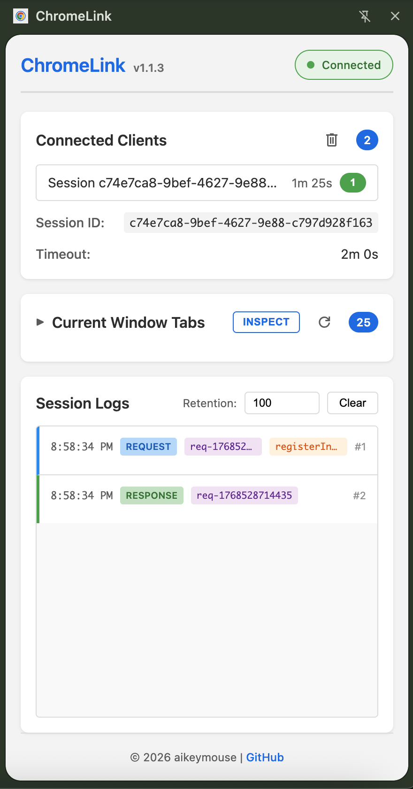
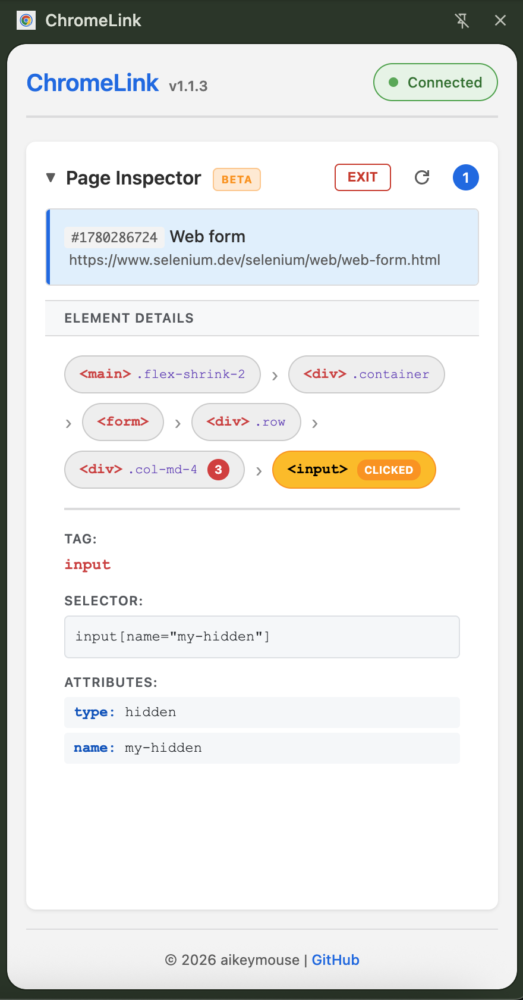

# ChromeLink

Remote Chrome tab control via WebSocket API with session management and side panel UI.

[](https://www.patreon.com/aikeymouse)

## Features

- **WebSocket API**: Control Chrome tabs remotely via WebSocket connection
- **Session Management**: Create sessions with configurable timeouts, resume existing sessions
- **Tab Operations**: List, open, navigate, switch, close tabs in current active window
- **JavaScript Execution**: Execute JavaScript in tabs with configurable timeout and result return
- **Script Injection**: Register early script injections for WebView2 mocking, test configuration, and API interception without debugger warnings
- **Inspector Mode**: Interactive element inspection with detailed DOM tree analysis and CSS selectors
- **Helper Functions**: Comprehensive DOM operations for CSP-restricted pages including click, type, highlight, element bounds, viewport scrolling, and container analysis
- **Screenshot Capture**: Full page or element-cropped screenshots with base64 PNG output
- **Side Panel UI**: Monitor connected clients, view session details, manage script injections, track logs in real-time
- **Per-Session Logging**: All requests/responses logged to dedicated session files with configurable retention
- **Chunked Messages**: Handle large results with automatic 1MB chunking
- **Auto-Restart**: Native host automatically restarts on extension updates

## Screenshots

| Session Logs | Inspector Mode |
|:------------:|:--------------:|
|  |  |

## Architecture

```
Client App (WebSocket) ←→ Node.js Native Host ←→ Chrome Extension (Service Worker)
                                   ↓                           ↓
                          Session Log Files              Side Panel UI
```

## Installation

See [INSTALL.md](INSTALL.md) for complete installation instructions.

## Usage

### Create a Session

```bash
curl -X POST "http://localhost:9000/session?timeout=300000"
```

Response:
```json
{"status":"ready","message":"Upgrade to WebSocket"}
```

Parameters:
- `timeout`: Session timeout in milliseconds (default: 300000 = 5 minutes)
- `sessionId`: (Optional) Resume existing session if not expired

Then connect via WebSocket client (see `examples/` for Node.js client examples).

### WebSocket Commands

Once connected via WebSocket, send JSON commands:

#### List Tabs
```json
{
  "action": "listTabs",
  "requestId": "req-001"
}
```

#### Open Tab
```json
{
  "action": "openTab",
  "params": {
    "url": "https://example.com",
    "focus": true
  },
  "requestId": "req-002"
}
```

#### Navigate Tab
```json
{
  "action": "navigateTab",
  "params": {
    "tabId": 123,
    "url": "https://google.com",
    "focus": false
  },
  "requestId": "req-003"
}
```

#### Switch Tab
```json
{
  "action": "switchTab",
  "params": {
    "tabId": 123
  },
  "requestId": "req-004"
}
```

#### Execute JavaScript
```json
{
  "action": "executeJS",
  "params": {
    "tabId": 123,
    "code": "document.title",
    "timeout": 30000,
    "focus": false
  },
  "requestId": "req-005"
}
```

Parameters:
- `tabId`: (Optional) Tab ID, defaults to active tab
- `code`: JavaScript code to execute
- `timeout`: (Optional) Execution timeout in ms (default: 30000)
- `focus`: (Optional) Focus Chrome window before execution

### Response Format

```json
{
  "requestId": "req-001",
  "result": { ... },
  "error": null
}
```

For large results (>1MB), responses are chunked:
```json
{
  "requestId": "req-001",
  "chunk": "...",
  "chunkIndex": 0,
  "totalChunks": 3
}
```

## Configuration

### Log Retention

Configure log retention in the Side Panel UI:
- Default: 100 entries
- Adjustable via UI slider
- Older entries auto-deleted when limit exceeded

### Session Timeout

Set per-session when creating connection:
- Default: 5 minutes (300000 ms)
- Configurable via `timeout` parameter
- Session extends on activity

## Development

See [docs/dev/DEVELOPMENT.md](docs/dev/DEVELOPMENT.md) for development setup and guidelines.

## Protocol Documentation

See [docs/PROTOCOL.md](docs/PROTOCOL.md) for complete API documentation.

## License

This project is licensed under the Creative Commons Attribution-NonCommercial-NoDerivatives 4.0 International License (CC BY-NC-ND 4.0).

See [LICENSE](LICENSE) file for details.
