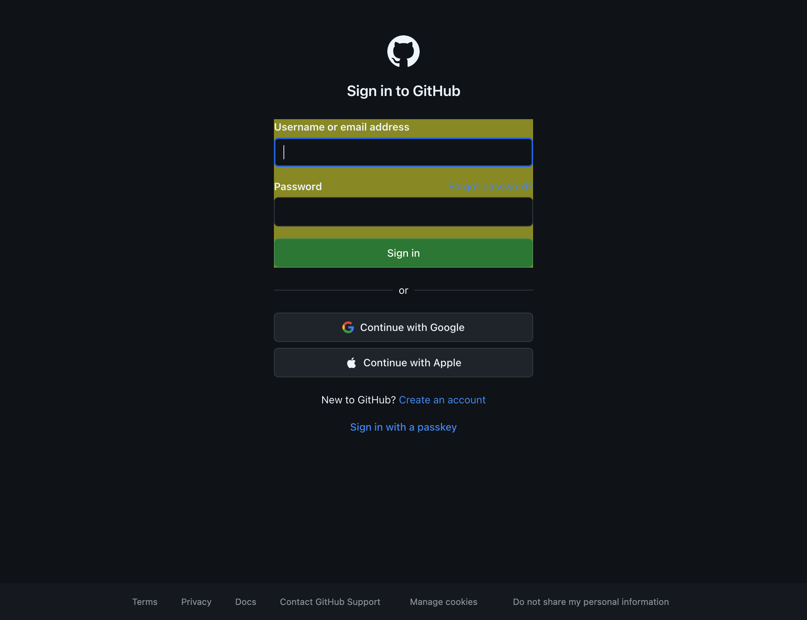
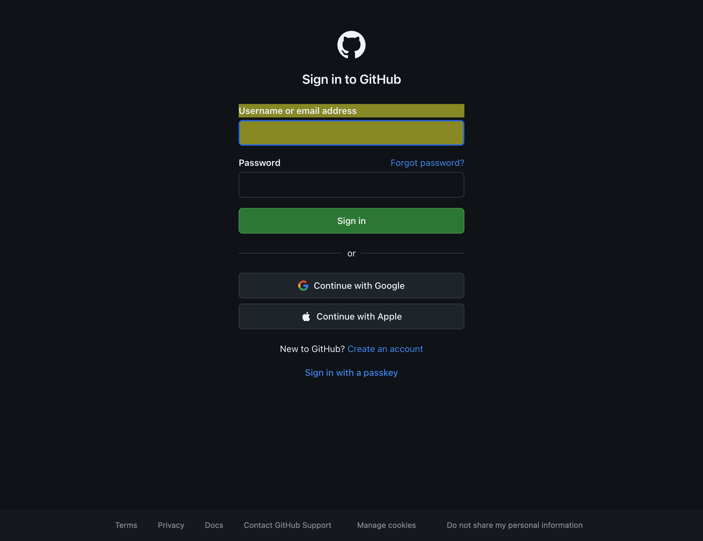
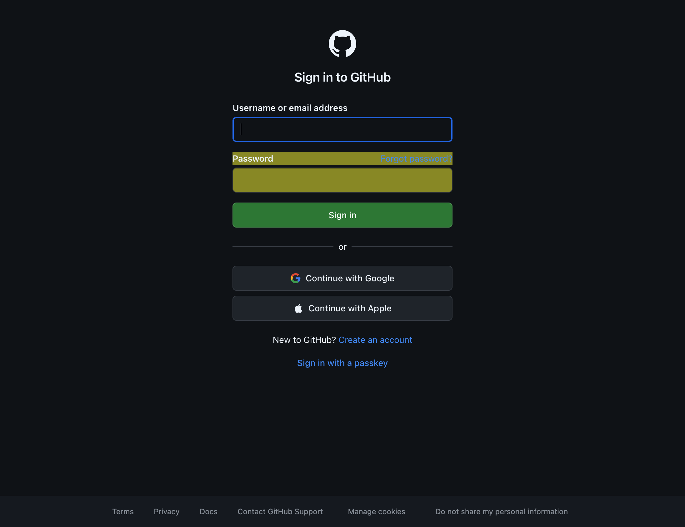
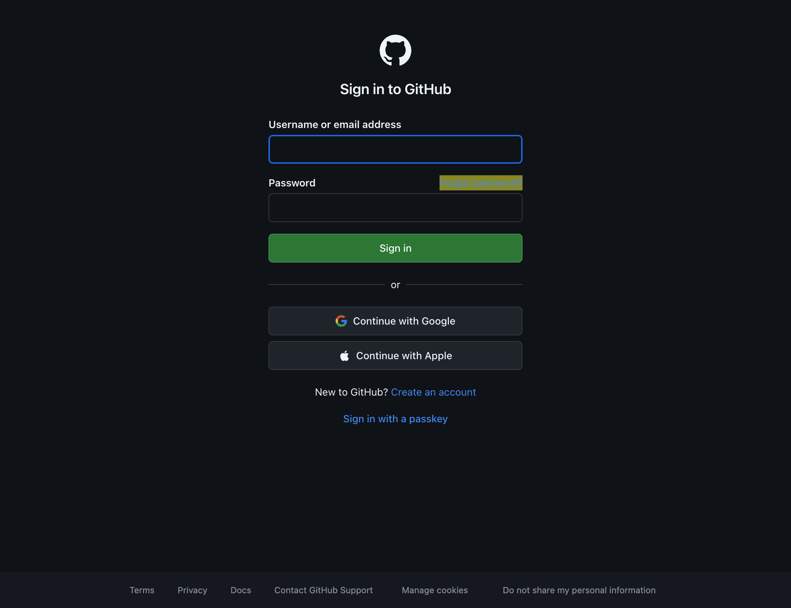

# Form Analysis Report

**URL:** https://github.com/login

**Container:** `div:nth-child(1) > div:nth-child(4) > main:nth-child(1) > div:nth-child(1) > div:nth-child(2) > form:nth-child(3)`

**Total Elements:** 7

**Validation:** 7 unique selectors, 0 ambiguous


## Full Page View


## Table of Contents
- [INPUT-TEXT](#input-text)
- [INPUT-PASSWORD](#input-password)
- [LINK](#link)
- [INPUT-SUBMIT](#input-submit)

## INPUT-TEXT
Found 2 item(s)

### Username or email address


**Label Selector:**
```css
label[for="login_field"]
```

**Field Selector:**
```css
#login_field
```

**Field Details:**

- **Label:** Username or email address
- **Type:** `input` (`text`)
- **Name:** `login`
- **ID:** `login_field`

---

### required_field_c4a2

**Selector:**
```css
input[name="required_field_c4a2"]
```

**Element Details:**

- **Type:** `input` (`text`)
- **Name:** `required_field_c4a2`
- **Label Selector:** `required_field_c4a2`

---

## INPUT-PASSWORD
Found 1 item(s)

### Password


**Label Selector:**
```css
label[for="password"]
```

**Field Selector:**
```css
#password
```

**Field Details:**

- **Label:** Password
- **Type:** `input` (`password`)
- **Name:** `password`
- **ID:** `password`

---

## LINK
Found 1 item(s)

### Forgot password?


**Selector:**
```css
#forgot-password
```

**Element Details:**

- **Type:** `a`
- **ID:** `forgot-password`
- **Text:** "Forgot password?"
- **Label Selector:** `label[for="forgot-password"]`

---

## INPUT-SUBMIT
Found 1 item(s)

### commit
![input[name="commit"]](screenshots/element-005.png)

**Selector:**
```css
input[name="commit"]
```

**Element Details:**

- **Type:** `input` (`submit`)
- **Name:** `commit`
- **Value:** "Sign in"
- **Label Selector:** `commit`

---

---

*Generated on 1/14/2026, 7:47:24 PM*
