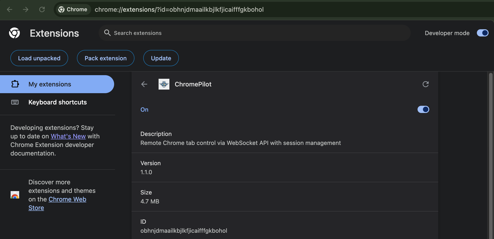

# ChromePilot Installer

Cross-platform installation tool for ChromePilot native host.

## Extension Panel



## Requirements

- Node.js 18+ and npm
- Google Chrome browser
- macOS, Linux, or Windows

## Quick Start

```bash
node install.js
```

This will:
1. Check Node.js and npm versions
2. Copy native host files to `~/.chrome-pilot/` (macOS/Linux) or `%LOCALAPPDATA%\ChromePilot\` (Windows)
3. Install Node.js dependencies
4. Register native messaging host with Chrome
5. Preserve existing logs during upgrade

## Commands

### install
Install or upgrade ChromePilot native host (default command)

```bash
node install.js
# or
node install.js install
```

**What it does:**
- Creates installation directory
- Backs up existing logs (if upgrading)
- Copies native host files
- Restores logs from backup
- Runs `npm install --production`
- Creates native messaging manifest for Chrome
- Verifies installation

**Installation paths:**
- **macOS**: `~/.chrome-pilot/native-host/`
- **Linux**: `~/.chrome-pilot/native-host/`
- **Windows**: `%USERPROFILE%\.chrome-pilot\native-host\`

**Native messaging manifest:**
- **macOS**: `~/Library/Application Support/Google/Chrome/NativeMessagingHosts/`
- **Linux**: `~/.config/google-chrome/NativeMessagingHosts/`
- **Windows**: `%LOCALAPPDATA%\Google\Chrome\User Data\NativeMessagingHosts\`

**Windows Registry:**
- **Key**: `HKEY_CURRENT_USER\Software\Google\Chrome\NativeMessagingHosts\com.chromepilot.extension`
- **Value**: Path to manifest JSON file
- **Note**: Registry entry is required on Windows in addition to the manifest file

### diagnose
Run diagnostic checks on your installation

```bash
node install.js diagnose
```

**Checks:**
- Node.js and npm versions
- Installation directory exists
- Native host server file exists
- Node.js dependencies installed
- Native messaging manifest registered
- Windows Registry entry (Windows only)
- Extension ID configured
- Server status (port 9000 listening)
- Recent log files with location

**Output example:**
```
[INFO] ChromePilot - Diagnostics
==========================

System Information:
  OS: darwin
  Node.js: v22.16.0
  npm: 10.9.2

Installation Status:
  Install Dir: /Users/user/.chrome-pilot [OK]
  Native Host: Found [OK]
  Dependencies: Installed [OK]

Native Messaging Manifest:
  Location: .../com.chromepilot.extension.json [OK]
  Extension ID: abcdefghijklmnopqrstuvwxyzabcdef [OK]
  Launch Script: launch.sh
    Path: /Users/user/.chrome-pilot/native-host/launch.sh
    Exists: [OK]

Windows Registry:  (Windows only)
  Registry Key: [OK]
    HKCU\Software\Google\Chrome\NativeMessagingHosts\com.chromepilot.extension
    Path: C:\Users\user\AppData\Local\Google\Chrome\...\com.chromepilot.extension.json

Server Status:
  Server Process: Running (PID: 12345) [OK]
  Port 9000: Listening [OK]

Recent Logs:
  Location: /Users/user/.chrome-pilot/native-host/logs [OK]
  Files: 2 log file(s)
    - session-abc123-1768108888180.log (94905 bytes)
    - session-xyz789-1768109999999.log (12340 bytes)
```

### clear-logs
Clear session log files

```bash
node install.js clear-logs
```

**What it does:**
- Removes all `.log` files from the logs directory
- Shows count of files deleted
- Preserves the logs directory itself

**Use when:**
- Logs are taking up too much space
- You want a clean slate for debugging
- Before sharing diagnostics output

### update-id
Update the Chrome extension ID in the native messaging manifest

```bash
node install.js update-id <extension-id>
```

**Arguments:**
- `<extension-id>`: Your Chrome extension ID (32 lowercase letters)

**Example:**
```bash
node install.js update-id abcdefghijklmnopqrstuvwxyzabcdef
```

**What it does:**
- Validates extension ID format (must be 32 lowercase letters)
- Creates backup of current manifest
- Updates `allowed_origins` in manifest with your extension ID
- Verifies the update was successful

**How to get your extension ID:**
1. Open Chrome and go to `chrome://extensions/`
2. Enable "Developer mode" (toggle in top right)
3. Find ChromePilot extension
4. Copy the ID shown below the extension name

### uninstall
Remove ChromePilot installation completely

```bash
node install.js uninstall
```

**What it removes:**
- Installation directory (`~/.chrome-pilot/` or `%USERPROFILE%\.chrome-pilot\`)
- Native messaging manifest
- Windows Registry entry (Windows only)
- All logs and data
- Running server processes

**Note:** You must manually remove the Chrome extension:
1. Open `chrome://extensions/`
2. Find ChromePilot
3. Click "Remove"

### version
Show installed version

```bash
node install.js version
# or
node install.js --version
node install.js -v
```

### help
Show help message with all commands

```bash
node install.js help
# or
node install.js --help
node install.js -h
```

## Complete Installation Guide

### Step 1: Install Native Host

```bash
cd chromepilot-native-host-v*/install-scripts
node install.js
```

You should see:
```
[INFO] ChromePilot - Installer
==========================

[INFO] Checking dependencies...
[OK] Node.js v22.16.0 found
[OK] npm 10.9.2 found
[INFO] Installing from local files...
[INFO] Backing up existing logs...
[INFO] Copying native host files...
[INFO] Restoring logs...
[INFO] Installing Node.js dependencies...
[INFO] Registering native messaging host...
[OK] Native host registered
[INFO] Verifying installation...
[OK] Installation verified
[OK] Installation complete!
```

### Step 2: Load Chrome Extension

1. Download `chromepilot-extension-v*.zip` (separate download)
2. Extract the zip file
3. Open Chrome and go to `chrome://extensions/`
4. Enable "Developer mode" (toggle in top right)
5. Click "Load unpacked"
6. Select the extracted extension folder
7. Copy the extension ID (shown below extension name)

### Step 3: Update Extension ID

```bash
node install.js update-id <your-extension-id>
```

Example:
```bash
node install.js update-id abcdefghijklmnopqrstuvwxyzabcdef
```

### Step 4: Restart Chrome

Close and reopen Chrome completely for changes to take effect.

### Step 5: Verify Connection

1. Click the ChromePilot extension icon
2. Side panel should open
3. Check connection status (should show "Connected")

## Troubleshooting

### Installation fails with "Node.js 18+ required"

**Solution:** Upgrade Node.js
```bash
# Check current version
node --version

# Install latest LTS from https://nodejs.org/
```

### "Extension ID: NOT SET [WARNING]"

**Solution:** Update the extension ID
```bash
# Get extension ID from chrome://extensions/
node install.js update-id <your-extension-id>
```

### "Native Host: NOT FOUND [ERROR]"

**Solution:** Reinstall
```bash
node install.js
```

### Extension shows "Disconnected"

**Solution:** Check diagnostics and restart
```bash
# Run diagnostics
node install.js diagnose

# Check for errors, then restart Chrome
```

### "Port 9000 already in use"

**Solution:** Kill existing processes
```bash
# macOS/Linux
lsof -ti :9000 | xargs kill -9

# Windows
netstat -ano | findstr :9000
taskkill /PID <PID> /F
```

### Logs show errors

**Solution:** Check log files
- **macOS/Linux**: `~/.chrome-pilot/native-host/logs/`
- **Windows**: `%USERPROFILE%\.chrome-pilot\native-host\logs\`

View recent logs:
```bash
# macOS/Linux
tail -f ~/.chrome-pilot/native-host/logs/*.log

# Windows (PowerShell)
Get-Content $env:USERPROFILE\.chrome-pilot\native-host\logs\*.log -Tail 50
```

Clear logs:
```bash
node install.js clear-logs
```

## Upgrading

To upgrade to a new version:

```bash
# The installer automatically backs up logs and restores them
node install.js
```

The installer will:
1. Detect existing installation
2. Create timestamped backup of logs
3. Install new version
4. Restore logs from backup
5. Update dependencies

## Uninstalling

To completely remove ChromePilot:

```bash
# Remove native host
node install.js uninstall

# Then manually remove Chrome extension from chrome://extensions/
```

## Platform-Specific Notes

### macOS

- Installation directory: `~/.chrome-pilot/`
- Manifest location: `~/Library/Application Support/Google/Chrome/NativeMessagingHosts/`
- Server runs via Node.js executable from system PATH

### Linux

- Installation directory: `~/.chrome-pilot/`
- Manifest location: `~/.config/google-chrome/NativeMessagingHosts/`
- Requires Chrome or Chromium browser

### Windows

- Installation directory: `%USERPROFILE%\.chrome-pilot\`
- Manifest location: `%LOCALAPPDATA%\Google\Chrome\User Data\NativeMessagingHosts\`
- Registry entry: `HKEY_CURRENT_USER\Software\Google\Chrome\NativeMessagingHosts\com.chromepilot.extension`
- Server runs via `launch.bat` script (not direct node.exe command)
- **Important**: Windows 11 requires both manifest file AND registry entry
- Uninstall waits for processes to terminate before removing files

## Files Created

### Installation Directory Structure

```
~/.chrome-pilot/  (or %USERPROFILE%\.chrome-pilot\ on Windows)
└── native-host/
    ├── browser-pilot-server.js    # Main server
    ├── launch.sh                  # Launch script (macOS/Linux)
    ├── launch.bat                 # Launch script (Windows)
    ├── package.json               # Dependencies
    ├── node_modules/              # Installed packages
    └── logs/                      # Session logs
        └── session-*.log
```

### Native Messaging Manifest

**File:** `com.chromepilot.extension.json`

**Contents (macOS/Linux):**
```json
{
  "name": "com.chromepilot.extension",
  "description": "ChromePilot Native Messaging Host",
  "path": "/Users/user/.chrome-pilot/native-host/launch.sh",
  "type": "stdio",
  "allowed_origins": [
    "chrome-extension://<your-extension-id>/"
  ]
}
```

**Contents (Windows):**
```json
{
  "name": "com.chromepilot.extension",
  "description": "ChromePilot Native Messaging Host",
  "path": "C:/Users/user/.chrome-pilot/native-host/launch.bat",
  "type": "stdio",
  "allowed_origins": [
    "chrome-extension://<your-extension-id>/"
  ]
}
```

**Note:** All platforms now use launch scripts (launch.sh or launch.bat) instead of direct node command arrays.

## Environment Variables

The installer uses these environment variables:

- `HOME` (macOS/Linux): User home directory
- `LOCALAPPDATA` (Windows): Local application data directory
- `PATH`: To find Node.js executable

## Exit Codes

- `0`: Success
- `1`: Error (check error message)

## Getting Help

- Run diagnostics: `node install.js diagnose`
- View help: `node install.js help`
- Check logs in installation directory
- Report issues on GitHub

## Advanced Usage

### Silent Installation (No User Prompts)

The installer runs non-interactively by default. For automation:

```bash
node install.js 2>&1 | tee install.log
```

### Custom Node.js Path

The installer uses the Node.js executable from your current environment:

```bash
# Use specific Node.js version
/path/to/node install.js

# Or use nvm
nvm use 18
node install.js
```

### Preserve Specific Logs

Logs are automatically backed up and restored. To manually preserve:

```bash
# Before installation
cp -r ~/.chrome-pilot/native-host/logs ~/backup-logs

# After installation
cp -r ~/backup-logs/* ~/.chrome-pilot/native-host/logs/
```

## Development

For development with local source:

```bash
# From repository root
cd install-scripts
node install.js

# This installs from ../native-host/
```

## Why install.js?

The Node.js installer (`install.js`) is the only installer provided:

- ✅ Works on macOS, Linux, and Windows
- ✅ Single codebase, easier to maintain
- ✅ Better error handling with JavaScript
- ✅ No shell/PowerShell version conflicts
- ✅ Consistent behavior across platforms
- ✅ Windows 11 tested with registry support
- ✅ Comprehensive diagnostics with server status
- ✅ Log management (view location, clear logs)

Previous shell-based installers (install.sh, install.bat, install.ps1) have been removed in favor of this unified solution.
